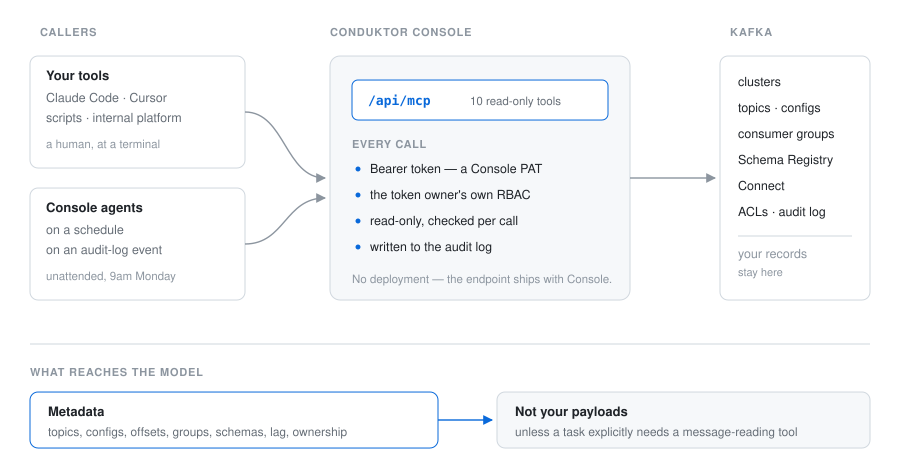

# Conduktor MCP

**Put an AI assistant in charge of your Kafka estate.**

Not a chat window onto a cluster. A way for agents — yours, or ours — to see what is actually
happening across every cluster you run, and to act on it: reclaim the topics nobody consumes,
attribute cost back to the teams spending it, catch the certificate expiring next month, restart
the connector that failed at 3am, label the topics whose owner left the company.

The MCP endpoint ships inside [Conduktor Console](https://www.conduktor.io/console). There is
nothing to deploy, and nothing new to secure: the assistant inherits the RBAC, audit trail and
ownership model you already run.



## Try it first

No Kafka to hand? [`demo/`](demo/) brings up a cluster, Console and the MCP endpoint with
`docker compose up -d`, seeded with topics, traffic and a consumer group that is deliberately
behind.

## Setup

Create a Personal Access Token in Console, then point your MCP client at your own Console:

```json
{
  "mcpServers": {
    "conduktor": {
      "command": "npx",
      "args": ["-y", "@conduktor/mcp"],
      "env": {
        "CONDUKTOR_CONSOLE_URL": "https://console.acme-corp.com",
        "CONDUKTOR_API_TOKEN": "your-personal-access-token"
      }
    }
  }
}
```

`/api/mcp` is appended for you. Pasting a URL that already ends in it works too.

<details>
<summary>Connecting without the package</summary>

`@conduktor/mcp` wraps [`mcp-remote`](https://www.npmjs.com/package/mcp-remote). Call it
yourself if you prefer:

```json
{
  "mcpServers": {
    "conduktor": {
      "command": "npx",
      "args": [
        "mcp-remote",
        "https://console.acme-corp.com/api/mcp",
        "--header",
        "Authorization: Bearer ${CONDUKTOR_API_TOKEN}"
      ],
      "env": { "CONDUKTOR_API_TOKEN": "your-personal-access-token" }
    }
  }
}
```

</details>

## What an assistant can ask

Ask in English, get answers grounded in your actual estate rather than in documentation:

> *Which topics haven't been consumed in a month, and who created them?*
> *What did the payments team cost us last quarter, and what drove it?*
> *This consumer group is stuck — what's the blocking message?*
> *Which certificates expire before March, and whose are they?*
> *Nobody owns these topics. Can you work out who should, from the lineage?*

Those are not demos. Each maps onto tools below, and onto tasks an agent can run unattended.

## From answering to operating

The same catalogue serves two kinds of caller. Your tools — Claude Code, Cursor, scripts, your
internal developer platform — and **agents running inside Console**, on a schedule or on an
audit-log event, under their own machine identity.

That second one is where this stops being a chatbot. An agent is a task plus an identity plus a
bounded set of tools. It wakes up on Monday at 9am, or the moment a connector fails, works the
problem, and comes back with something you can act on — a report, a recommendation, or a
mutation it proposes and you approve.

Every run is traced end to end: the prompt, each tool call, the tokens, the result. That is what
you attach to a ticket, or hand to an auditor.

## Tools

Thirty-one, across the whole control plane. Most read; some write, and that set is growing.

### Clusters

| Tool | What it does |
| --- | --- |
| `list-clusters` | Every Kafka cluster this Console manages, with its Schema Registry, Connect clusters and flavor |
| `get-cluster` | One cluster's registration by slug |
| `insights-cluster` | Health score, topic and partition counts, serialization breakdown — the shape of a cluster in one call |

### Topics

| Tool | What it does |
| --- | --- |
| `list-topics` | Topic catalogue: names, labels, descriptions, partitions, replication, configs |
| `get-topic` | One topic by exact name |
| `list-topics-with-usage` | Topics with message count, size and throughput |
| `query-topics` | Filter topics across a cluster |
| `aggregate-topics` | Group topics and compute a statistic per group — count, sum, average, min, max |
| `insights-topics` | Partition skew, replication problems, and what is quietly wrong |
| `set-topic-labels` **(writes)** | Label topics — ownership, environment, whatever your taxonomy is |

### Messages

| Tool | What it does |
| --- | --- |
| `get-last-messages` | The last N messages from a topic |
| `get-record-at` | A specific record, by partition and offset — the one blocking a consumer |

### Consumer groups

| Tool | What it does |
| --- | --- |
| `list-consumer-groups` | Groups with state, lag and member count |
| `get-consumer-group` | One group in detail |
| `list-consumer-groups-by-topic` | Who actually reads this topic |

### Schemas

| Tool | What it does |
| --- | --- |
| `list-subjects` · `get-subject` · `list-subject-names` | The subject catalogue |
| `get-schema-version` | A specific version |
| `check-schema-compatibility` | Whether a change breaks consumers, before it ships |

### Connect, Gateway

| Tool | What it does |
| --- | --- |
| `list-connectors-detailed` · `get-connector` | Connectors and their state |
| `list-interceptors` | Gateway interceptors configured on a cluster |

### Access, identity, governance, cost

| Tool | What it does |
| --- | --- |
| `list-acl-bindings` | Who is allowed to do what |
| `list-service-accounts` · `get-service-account` | Non-human identities |
| `list-certificates` | Certificates and their expiry |
| `list-applications` | Applications registered in the catalogue |
| `get-stream-lineage` | What flows into what |
| `query-audit-log` | Who did what, when |
| `get-chargeback-report` | Cost attributed per team |

## Security is what makes this possible

Giving an agent real access to production is only reasonable because the boundaries already
exist and are enforced per call.

**It is you.** Every call carries a Console token and runs under that user's RBAC. An agent
cannot see a cluster its owner cannot see. Revoke the owner's access and the agent loses it at
the same instant.

**Control plane, not data plane.** What reaches the model is metadata — topics, configs,
offsets, groups, schemas, lineage, cost. Your records stay in Kafka unless a task explicitly
needs a tool that reads them.

**Everything is audited.** Every call lands in the Console audit log, attributable to the
identity that made it.

## Documentation

- [MCP server guide](https://docs.conduktor.io/guide/conduktor-in-production/automate/mcp)
- [Product page](https://www.conduktor.io/mcp)
- [Console documentation](https://docs.conduktor.io/)

## What is in this repository

The launcher published as [`@conduktor/mcp`](https://www.npmjs.com/package/@conduktor/mcp), this
documentation, and the registry metadata. The server itself runs inside Console. For bugs in the
server use Conduktor support; for the launcher or these docs, open an issue here.
